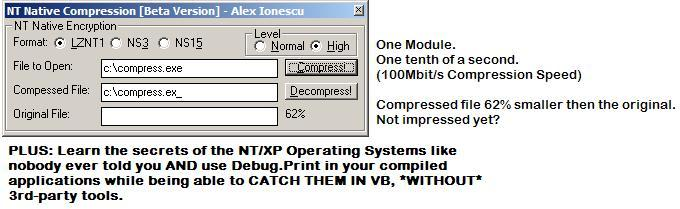



## A 3\-in\-1: Studying's XP/NT's Core, Fastest Compression Ever, and Debug\.Print in Compiled Programs

### Description

This article will show you three things, accompagnied by code:

1st, the deep internals of the NT and XP Operating System (They are the same) in an easy-to-understand language and format that isn't written for Assembly Code Developpers.

2nd, using the techniques in the article, an ultra-fast compression program will be shown, based on an undocumented, hidden, Native API of Windows NT/XP. This is the fastest compression I've ever seen using VB code.

3rd, A technique in using Debug.Print in compiled applicaitons will be shown (this has already been on PSC), however, my implementation will also show you how to catch those debug messages, not only from your application but from all others.

Enjoy and I hope you had a nice Halloween!
 
### More Info
 

             |
---                |---
**Submitted On**   |2003-11-01 17:47:42
**By**             |[Ion Alex Ionescu](https://github.com/Planet-Source-Code/PSCIndex/blob/master/ByAuthor/ion-alex-ionescu.md)
**Level**          |Advanced
**User Rating**    |4.9 (450 globes from 91 users)
**Compatibility**  |VB 4\.0 \(32\-bit\), VB 5\.0, VB 6\.0, VB Script
**Category**       |[Windows API Call/ Explanation](https://github.com/Planet-Source-Code/PSCIndex/blob/master/ByCategory/windows-api-call-explanation__1-39.md)
**World**          |[Visual Basic](https://github.com/Planet-Source-Code/PSCIndex/blob/master/ByWorld/visual-basic.md)
**Archive File**   |[A\_3\-in\-1\_\_1666041112003\.zip](https://github.com/Planet-Source-Code/ion-alex-ionescu-a-3-in-1-studying-s-xp-nt-s-core-fastest-compression-ever-and-debug-print__1-49591/archive/master.zip)

### Source Code

<b>NT (and XP) Native API Compression</b> 
<i>(And how the NT API works)</i>

 
First off I’d like to thank everyone that has voted for my past two articles (on
CreateRemoteThread and NTFS Streams). For those people... neat things are
coming! I will be updating the CRT code this month to allow injection into any
process without any crash or using complicated add-ins, as well as putting full
VB forms, COM objects and more. With it, you will be able to add COM interfaces
to any program. And for those who enjoyed the NTFS Article, I’m currently
updating it with a full NTFS Low-Level Disk Browser. But enough of the future,
let’s talk about the present! Without further ado, let’s first talk about what
NT is. 
 

<b>Chapter 1 – How NT works, in the average programmer’s
words.</b>

<b>1.1 - Introduction to NT (N-Ten...not New Technology or
Northern Telecom!)</b>

Without delving too deep into the internals of NT (I’m
leaving that for another article), it is important to know that NT itself was
designed to support many subsystems, each with a distinct environment. An
example of an NT Subsystem is Win32, or normal Windows applications; another one
is OS/2, or POSIX (Unix). This means that NT can (by the way, throughout all
this article, NT means anything from NT 3.51 till Windows 2003, including XP),
with the proper system add-ins, run OS/2 and Unix without any changes in them at
all, and supporting most of their features. This is one of NT’s biggest
advantages...but what does it mean for the API? To support this architecture,
the NT developers needed to have a unified set of APIs that could be called by
wrappers of each subsystem. As such, the Win32 CreateProcess API should work
just as well as the fork() command in a Unix application. Instead of creating an
API call or huge libraries for all the subsystems, NT is, at the base, a single
Kernel and HAL (The Hardware Layer that the Kernel uses to access the hardware).
The kernel contains all the functions that NT supports, be it under Win32, Unix,
or OS/2. In turn, the subsystems have all the DLLs needed for their own API. The
Win32 apps call the Win32 Subsystem APIs, which in turn call the NT APIs. These
NT APIs are called “Native”, because they require no Subsystem to run. If you’re
curious about who’s who, here’s a breakdown of some of the files:

<blockquote>
	
· HAL.DLL, the core component of NT’s Hardware Access.
	This is the HAL-9000 (reference to Odyssey 2001) of the NT OS. 
	· NTOSKRNL.EXE, the kernel itself, the brain of the OS. Also called
	Executive. 
	· NTDLL.DLL, the kernel API library, which contains the Native APIs. 
	· WIN32K.sys, the graphics API library of NT. Because OS/2 and Unix graphic
	applications are not supported, this normally Win32 subsystem file has
	become part of the kernel. 
	· CSRSS.EXE, the Win32 Subsystem Client 
	· KERNEL32.DLL, USER32.DLL, GDI32.dll, the main Win32 Core Subsystem APIs.

</blockquote>

So you must be wondering, “What really happens when I call
CreateProcess then?”. When you call that API (or ShellExecute, which ends up
calling it anyway), Windows processes the parameters and calls a function called
NtCreateProcess. This API is the NT Native API to create a new process, and is
contained in NTDLL.DLL. Does this API create your process? No! Because of
reasons that I will explain in section 1.2, NTDLL.DLL then does what is called a
“System Call”, or a “Native System Service”. This ultimately results in a
low-level code (assembly language or C) contained in NTOSKRNL.EXE executing,
called ZwCreateProcess in our case.

As you’ve seen, your simple Win32 call ends up going through
a lot of hoops. And that’s without talking about all the little APIs that are
called when you call CreateProcess. Everything from preparing the environment to
loading each of the DLLs your process will use will be done, and all the calls
(such as LoadLibrary) will pass through the same hoops. For a function like
CreateProcess, you can expect at least 50 API calls. I’ve explained why
everything ends up in NTDLL.DLL...but why the “System Call”?

<b>1.2 - Kernel-Mode and User-Mode (or why NT rarely crashes)</b>

Before explaining what a syscall (System Call), it’s
important to talk about how NT manages memory, and everything contained inside
it. Once again, to keep this understandable, I’m going to cut some corners. On
32-bit CPUs and modern OS, your programs never access your physical memory in a
direct manner (this is called Protected Mode, in contrast to Real Mode). When
you call CopyMemory (RtlMoveMemory), you’re not giving physical addresses of
your memory...you’re giving the address of Virtual Memory. Virtual Memory is one
of the reasons that a DLL can be in the same Memory Space in all the programs
it’s running in. Once again, on 32-bit CPUs, Virtual Memory is defined to 4GB
(There are exceptions...no use getting into them), starting from 0x0 till
0xFFFFFFFF in Hex. 0x0 till 0x10000 is reserved and never used, so it actually
starts at 0x10000. From then on, there is a split at 0x80000000. Everything
under this is called User-Mode; everything above it is Kernel-Mode, so each
memory space gets 2GB.

By definition, User-Mode cannot access anything in
Kernel-Mode. Not a single line of code contained in Kernel-Mode memory can be
called, and not a single variable read. Direct hardware access, from USB mouse
till HDD is also totally out of the question (in most cases, using Windows API
mostly, not legacy ASM code). This is where your applications run...yes, even
those that control I/O ports or seem to do some extremely deep functions.
Kernel-Mode however is another beast. It has the uttermost complete access to
your computer, and the code inside that memory can do whatever it pleases, even
telling your CPU to run at 10GHz (I’m not making this up). There is no such
thing as a Kernel-Mode application; they are called Drivers, or Loadable Kernel
Modules. These are your video-card drivers, your mouse driver, and all those
files ending in SYS on your computer. In Win9x, they were VXDs. 
Now let’s get back to our CreateProcess example. What’s a syscall and why do we
need it? 

The functions inside the Executive (NTOSKRNL.EXE) are not
called APIs, but NT System Services (people confuse it with Windows Services,
which is why I prefer the name System Call). In essence, they function just like
APIs, except the way to call them is different. The Executive has a table of all
the possible System Calls and their corresponding ID. The NTDLL.DLL API then
finds out what ID it needs, and calls it using a special function (pros: stick
the ID in eax and then call INT 2e). The Executive will execute the function,
and return back to NTDLL.DLL, which will ultimately end up returning to your
program. Starting in Windows 2000, there are two possible syscalls. The first
are in the Executive, and contain all the system functions. The second have been
split up in WIN32K.SYS, which as mentioned above, controls all the graphic
routines (which are called by GDI32.DLL and sometimes USER32.DLL).

The question remaining is why does NT need to go through all
this complicated procedure to create a process? Taking back the subject of the
files mentioned at the beginning, it’s important to know that the Executive runs
in Kernel-Mode, just like the Hardware Abstraction Layer and the WIN32K.SYS
Module and all your Drivers. The subsystems run in USER-MODE. Can you guess why
it’s needed to use syscalls now? If you think about it, at the deepest and
lowest level, CreateProcess will need to allocate some memory, read the EXE file
from your disk, and process the code inside. We just said that User-Mode has no
access to things like reading your disk or touching physical memory (because
they are hardware functions). The only way is therefore to pass on the command
to the Executive, which along with the HAL will perform all the necessary
functions and return back to the Subsystem with your process. The same applies
for something as simple as BitBlt. This call, down the line, becomes EngBitBlt
inside Win32K.sys as a System Call. This is because to perform any graphics
function, we must use the Video Card, which is hardware and can only be touched
by Kernel-Mode.

As you can see, anything that needs hardware access will
ultimately be passed on to the Executive. And even if that doesn’t happen, it’s
very rare for a Subsystem to have any commands by itself, and 99% of the time it
will pass them on to NTDLL.DLL to perform the Native API, even if it doesn’t
require a System Call.

<b>1.3 - Key Concepts Review</b>

If you’re still a bit confused about how everything works, or
want to make sure you get everything right, this will present a short scenario
of a typical API call (in a very simplified form...but using the examples
above). 
You’ve created a VB application that calls CreateFile, instead of using
Open/Close VB commands because you know API is faster. You might not know it,
but by default, VB makes applications that run in the address 0x40000 in Virtual
Memory. Of course this is in User-Mode. When you call CreateFile, KERNEL32.DLL
receives your parameters (actually the VB runtime processes them first, but
that’s not important for now) and makes sure your call is valid before passing
it on. If you’ve made a very big programming mistake, the worst that might
happen is that your program will crash. 

If your parameters are correct however, KERNEL32 will call
NtCreateFile in NTDLL and arrange the parameters so they fit the new API (it
isn’t the same as the Win32 version). Once again, NtCreateFile does some more
checking. It’s very rare and almost impossible for a programming bug to get this
far, but if it happens, your program will still crash (Windows will be intact).

When NTDLL is sure that your parameters are correct, it will
call the ZwCreateFile syscall. A User-Mode component as I’ve said before cannot
normally call code in Kernel-Mode. However, syscalls are specially made to allow
a quick transition so that the code can run. A crash here will bring down the
system with a BSOD.

The Executive has now received all the necessary information
and will talk to the filesystem driver, which in turn will talk to the IDE or
SCSI Bus driver to physically create the file on your Hard Disk, or physically
read it.  
Once this is done, everything is returned back through the chain to your
program.

<b>Chapter 2 – The Native API, for a programmer</b>

<b>2.1 - Advantages of using Native API</b>

Now that you know about how Win32 API works, some of the
advantages of Native API should be evident. First of all, because you are
jumping over the whole Win32 Subsystem wrapping of your call, and sending it
directly to the NTDLL, your API will have slight performance increases. For
example, using the Native API to map a file into memory is about twice as fast.
However, unless you’re doing this hundreds of times in a row, the speed
difference will be something like 0.00001 seconds for a single call. 
The real advantage of using Native API therefore is its power. Technically,
Native API must support everything that a POSIX-Compliant UNIX application can
do. 

While you might not be familiar with Linux/Unix, I’m sure
you’ve heard that it has some pretty nice features that Windows lacks. Under NT,
this is usually not true. For example, on Unix/Linux systems, you can “fork” a
process. This will basically clone an existing process into a new one, but
without creating it yet. Both processes will have the same environment and
access to the same memory. When the user runs a Unix application on NT, NT will
however fork a process. How? The same way Win32 CreateProcess works. The Posix
Subsystem will first receive the fork() call, and then process it and send it to
the Native API, which will execute the function. The main API responsible is
still NtCreateProcess, the same one that a Win32 application would use (however,
it cannot call fork normally). With a bit of work, we can figure out how fork()
calls the NtCreateProcess API, and call the Native API from our Win32
application to do the same.

An easier example would be the extra features that Native API
offers as enhancements over the Win32 Subsystem APIs. For example, under Native
API, it is possible to resize a memory-mapped file, which Win32 API doesn’t let
you do. You can also specify dozens of more flags when creating a file, or
modify the execution of a process in more advanced ways. 

The biggest power of Native API however, will be discussed in
Section 2.3. But first, let’s have a look at the disadvantages.

<b>2.2 - Disadvantages of using Native API</b>

Let’s face the facts: Microsoft doesn’t want you, under any
circumstances to use Native API, or even know it exists. Only highly skilled
programmers can find out about how to use some of the functions in a package
called the DDK, Driver Development Kit. Access to the Native API is critical for
drivers, because they do not run under any subsystem. Drivers however, as I’ve
mentioned, run under Kernel Mode, so they call the Native API directly in the
Executive, and Microsoft has only documented the really critical functions
needed. 

The few documented Native APIs are only used in C++ examples.
You can forget about finding Declare Function Nt... Lib “ntdll” ... written in
VB anywhere. If Microsoft barely supports this under C++, you can imagine what
they think about VB calling Native API. Which means you’ll have to first
download the DDK, and then translate all the C++ declarations to VB. Not too
hard for an average programmer (you don’t really need to know C++), but not
something most people would easily do. The DDK is also fairly large, and you
usually have to order it from Microsoft. Fortunately however, OSROnline provides
a free online-viewable version.

These are just the disadvantages because of how hard it is to
find something as simple as calling the function. You will also need to check
out the DDK to learn what each parameter means. Furthermore, NT usually uses
lots of complex structures and “Objects” to perform system functions. It can be
very confusing at first, and with the minimal documentation available, often a
real pain.

Now that you’ve seen how hard it is do call a documented call
like NtCreateFile, try to imagine something undocumented. Yes, that’s right;
over 95% of NT’s Native API is purely undocumented. Microsoft not only doesn’t
document them, but it also denies their simple existence.

<b>2.3 - Undocumented Native API</b>

Fortunately, a quick search on Google will help you get some
information about these undocumented functions. Usually, someone, somewhere, has
decided to investigate on of these calls (if they seem interesting) and try to
figure out how they work. As hard as Microsoft can try, they still cannot remove
their existence from the Export Table of NTDLL, which contains all the names of
the APIs contained inside. Such a table can be viewed with the depends.exe tool
that comes with Visual Basic for example. You will usually find information
about undocumented Native API either on WINE (a free Win32 Subsystem for Linux),
which is struggling to emulate it, on NTInternals, or on various programmer’s
personal websites. I’ve explained how to find some information about them, but
why does Microsoft hide them so fervently?

As I’ve said before, the different subsystems that NT must
support have various features that the Native API must also support. However,
there is one more system component that needs access to the Native API, and
those are drivers in kernel-mode. Drivers don’t only need to perform hardware
access or other deep functions, but can sometimes simply want to create a file,
or get more information about the OS. As mentioned above, the DDK includes many
documented Native API functions that drivers may need to use. All these are in
NTDLL as well. You see, NTDLL is a double-faced library. Half of it runs in
User-Mode, and exposes the Nt* functions, while the other half runs in
Kernel-Mode and exposes the Zw* functions. Both are identical in name and
functionality…in fact, it is the Zw function that performs the syscall.
Internally, any Nt* function is switched to its Zw counterpart. Drivers however
can instantly call the Zw* functions. I’ve just said that these functions are
undocumented…so how can drivers call them if they are not in the DDK? Well the
truth is, most of the undocumented API is of course called by Windows Drivers
and internal services, not by hardware vendors, since MS won’t usually allow
them. 

This means that NT needs access to its own Native API, and
that every function in the Native API is also accessible by our program (in
fact, we can even perform a manual syscall from within our program, jumping
directly in the Executive and skipping NTDLL or the Win32 Subsystem). As such,
most of the functions that NT uses are undocumented and only used by the OS,
even if they would be quite useful to some programmers. 

To make things concrete, one example is the
NtQuerySystemInformation. It is barely officially documented by Microsoft, but
it is one of the most 3rd-party documented API of them all. Each site or person
has different information, but amassed together over 98% of the call’s
functionality has been found. Primarily, the function requires two main
parameters: the “information class” and the information structure to receive the
information requested. All in all, there have been over 50 information classes
discovered, and almost 40 documented, each one with their own structures,
sometimes containing over 100 elements, that themselves chain into others. These
information classes vary from anything to boot time and boot information, to a
collection of 30 timers and counters updated every 100 nanoseconds (we still
don’t know what they monitor) or even the total number of 100 nanoseconds that
have passed. More useful classes include the process class, which will show all
the running processes in individual structures that contain more then a hundred
elements, plus other chained structures for each thread with even more elements.
Anything that NT knows about every process will be shown in the uttermost
detail. You can also get a list of all open handles, and the process ID that
opens them…very useful if you’ve opened a file but forgot to close it, and can’t
delete it anymore. You can directly close it by knowing the handle. 

In sum, the undocumented Native APIs are the most powerful
ones available, but they are sadly even harder to implement then documented
ones.

<b>Chapter 3 – The Compression Application</b>

<b>3.1 - How it works</b>

This application relies on three heavily undocumented Native
APIs, RtlCompressBuffer, RtlDecompressBuffer and RtlGetWorkspace. Let’s start
analyzing the first one. By looking at the parameters it requires (some are
documented by NTInternals), we can see one of them is the Workspace parameter,
which seems to be a pointer to a temporary buffer where the compression can do
its work. It’s evident that we will need RtlGetWorkspace to get this buffer, but
after executing the call, we only get two numbers. Actually, the first one
corresponds to the size the buffer should be, and the second one isn’t of any
use to us. This means that we will have to create our own buffer with the
specific size.

Normally under VB you would create a byte array and size it
with Redim or a string that you would size with null characters or spaces.
Unfortunately, because of what seems to be a bug in the way VB handles its heap
(the memory space where these buffers are contained), we must create the buffer
in general virtual memory. If some of you have already done this before, you
know that a function called VirtualAlloc usually does this in the Win32 API.
However, since this application only works on NT and I talked a lot about NT
Native API, I’ve decided to use the Native version, NtAllocateVirtualMemory. The
API will give us a pointer to the buffer in memory that we can then use for
RtlCompressBuffer. The other parameters of this API are the compression engine
and format. For now, NT only supports a single format, called LZNT1, and only
two engines, Normal and High Compression. The latter is up to five time slower
and only offers an additional 5-15% boost in compression ratio. The call will
also need a variable in which it will report the final size of the compressed
data. Finally, the most important parameters are the input buffer and size, and
the output buffer and size. Once again, the buffers must be pointers in memory,
which brings a problem.

Therefore, if we want to compress files, we will need to load
them into memory. Many of you have already done this using Open … As #1 for
Binary read…and then used Get… to load the file into a byte array, but this is
excruciatingly slow for a compression, without mentioning the fact that you will
also need to write back the buffer to the file once it’s compressed. The
compression would take half a second, and your file access minutes. Using
CreateFile will also not help much, even if it’s faster, since you still need to
read/write back to the file. Fortunately, Windows has a mechanism that I’ve made
reference to before eelier, called File Memory Mapping. This functionality,
accessible easily with only two APIs (plus CreateFile to get a handle to the
file) will tell Windows to load the file into memory using a very quick internal
mechanism. Furthermore, any changes made to that memory location will be
immediately written to the disk by Windows, without any input from you. You are
basically editing the file on disk, but using memory functions, which are
hundreds of times faster. Once again, I’ve used the Native API versions, instead
of the normal Win32 CreateFileMapping and MapViewOfFile functions. Decompression
works exactly the same as compression, except that it doesn’t need a workspace
nor requires knowing the engine setting. 

<b>3.2 – Advantages</b>

Ah…now the interesting part! Why use this compression? Since
you’re probably tired and bored of reading so much text, this will be an easy
bulleted list with few explanations… I’m sure you’ll understand and appreciate
the examples easily.

· Native Compression works with memory pointers. As such, it
is one of the only compressions that works directly in memory, meaning you can
compress your own executable while running it, compress and string, structure or
byte array that VB puts in memory (just compress the VarPtr).

<blockquote>
	
· Native Compression is ultra fast. In fact, I believe
	the program shows the fastest compression written in VB. 
	· Native Compression yields very high ratios. Most of the time, Native
	Compression comes within 15-5% of Winzip’s compression, but sometimes even
	surpasses it for some file types. It is however, much faster. 
	· Native Compression only needs very few lines of code. No wrappers,
	external libraries or other contraptions are needed to make it work. 
	· Native Compression is easy to use, requiring no advanced algorithms or
	calling many functions in libraries. Only two simple API calls are used that
	simply specify input, output and compression strength. 
	· Native Compression can even be used in VBScript if implemented in an OCX
	control, yielding unparalleled compression speed and easiness for VBScript
	users. 
 

</blockquote>

<b>3.3 – Disadvantages</b>

Of course, everything has a bad side. Luckily, Native
Compression suffers very few disadvantages, mainly:

<blockquote>
	
· Native Compression only works on NT 3.51 and higher,
	but not Windows 98 or Windows Me. This means that your program will not work
	on about 20% of today’s computer market. 
	· Native Compression uses undocumented APIs. Microsoft may decide, without
	any obligation towards you, to remove this API either in a next version of
	Windows (and they probably will, since Longhorn is .NET based) or even in a
	single Service Pack. They can also modify and shuffle the parameters,
	rendering this code useless until further reverse engineering. 
 

</blockquote>

<b>Conclusion</b>

Well, that’s about it. If you’re ready to live with NT-based
only compression, then I’m sure you will find this program very useful. If not,
then at least I hope you had fun learning about the inner workings of the NT
Operating System. Next month, I will publish an article on NTFS (not just Data
Streams) and a disk defragmenter written in VB. I wish you all a happy month of
November!

Please remember to vote, thanks :)

